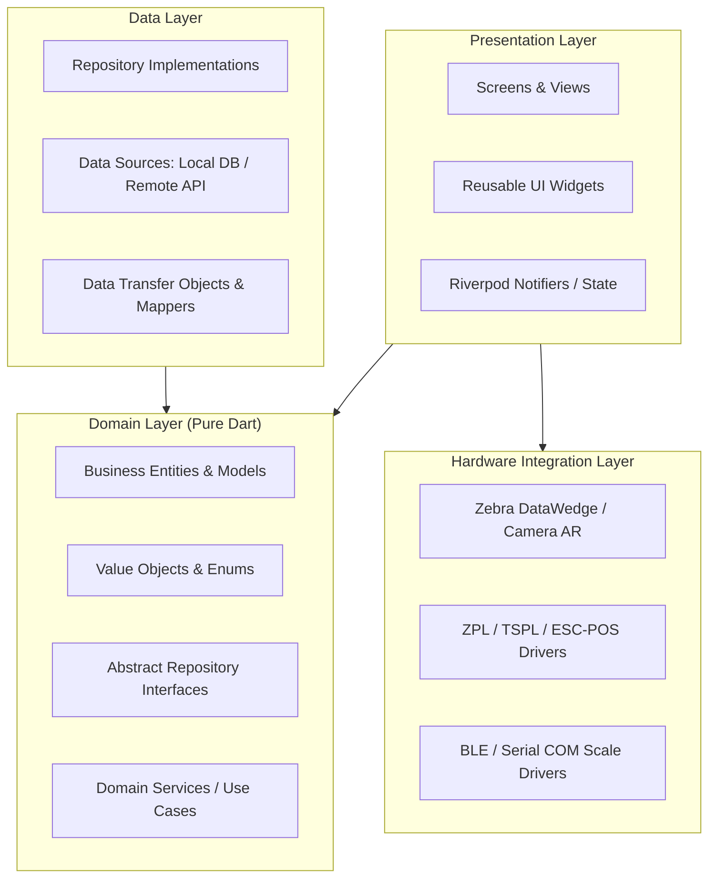

# System Architecture: Universal Warehouse Management System

---

## 1. Architectural Style & Principles

Universal WMS is built following **Clean Architecture** paired with a **Feature-First** modular organization in Flutter.

### Core Architectural Axioms
1. **Separation of Concerns:** Strict decoupling between UI (Presentation), Business Logic (Domain), and Data Sources (Data).
2. **Backend-Agnostic Abstraction:** The Presentation and Domain layers depend strictly on abstract repository interfaces (`IProductRepository`, `IInventoryRepository`, `IInboundRepository`). The application operates out-of-the-box using in-memory/local SQLite storage, and can be switched to any REST/GraphQL/gRPC backend (Spring Boot, .NET, Go, Supabase) by simply swapping the provider implementation.
3. **Dynamic Archetype Morphing (Open/Closed Principle):** Core data models use polymorphic attribute containers (`Map<String, dynamic> customAttributes` with typed validators) to support any industry vertical without altering the core database schema.
4. **Offline-First & Reactive State:** UI reacts to stream-based state managed by Riverpod 2.x code-generated providers.



---

## 2. Directory Layout (Feature-First)

```
lib/
├── main.dart                      # App entry point & dependency overrides
├── app.dart                       # Global MaterialApp, GoRouter config & theme
│
├── core/                          # Cross-cutting application infrastructure
│   ├── archetypes/                # Archetype definitions (Leather, Grocery, Bar, etc.)
│   ├── errors/                    # Failure classes & Exception handlers
│   ├── hardware/                  # Hardware drivers (Laser scanner, Thermal print, Scale)
│   ├── network/                   # Network client, interceptors, Result<T> wrapper
│   ├── rbac/                      # Roles, permissions, authorization guards
│   ├── storage/                   # Local storage (SharedPrefs, SecureStorage, Drift DB)
│   ├── theme/                     # Colors, typography, spacing, responsive breakpoints
│   └── utils/                     # Formatters, barcode generators, helpers
│
├── features/                      # Feature modules (Feature-First)
│   ├── auth_rbac/                 # Authentication, profile, role switcher
│   ├── dashboard/                 # Analytics, KPI cards, velocity charts
│   ├── products/                  # Catalog, variants, recipe BOM, categories
│   ├── warehouse_layout/          # 2D visual digital twin & bin mapping
│   ├── inbound/                   # Purchase orders, goods receipt, QC inspection
│   ├── outbound/                  # Sales orders, wave picking, packing stations
│   ├── inventory/                 # Realtime stock ledger, transfers, audit cycles
│   ├── scanner/                   # Multi-barcode AR camera & laser scanner listener
│   ├── pos_billing/               # Quick sale, POS checkout, table/bar orders
│   └── settings/                  # Store archetype selector, hardware config
│
└── shared/                        # Shared reusable UI components
    ├── widgets/                   # AppButton, AppTextField, AppDataGrid, Modal
    └── layouts/                   # ResponsiveShell, Sidebar, Header, Breadcrumbs
```

---

## 3. Feature Layer Anatomy

Each feature inside `lib/features/<feature_name>/` adheres to the 3-tier Clean Architecture structure:

```
features/products/
├── domain/
│   ├── models/                    # Product, ProductVariant, UnitOfMeasure
│   └── repositories/              # IProductRepository (Abstract contract)
├── data/
│   ├── datasources/               # MockProductDataSource, RemoteProductDataSource
│   ├── models/                    # ProductDTO with JSON / DB serialization
│   └── repositories/              # ProductRepositoryImpl
└── presentation/
    ├── controllers/               # ProductListNotifier, ProductFormNotifier
    ├── views/                     # ProductListScreen, ProductDetailScreen
    └── widgets/                   # ProductVariantTable, BarcodeBadge
```

---

## 4. State Management with Riverpod 2.x

We utilize **Riverpod 2.x with code generation** (`@riverpod` / `riverpod_annotation`):

```dart
// Example: Domain Repository Contract
abstract class IProductRepository {
  Future<Result<List<Product>>> getProducts({String? query, String? archetypeId});
  Future<Result<Product>> getProductById(String id);
  Future<Result<Product>> saveProduct(Product product);
  Future<Result<void>> deleteProduct(String id);
}

// Example: Riverpod Provider Definition
@riverpod
IProductRepository productRepository(ProductRepositoryRef ref) {
  // Can return MockProductRepositoryImpl, LocalDriftProductRepository, or ApiProductRepository
  return ref.watch(mockProductRepositoryProvider);
}

// Example: AsyncNotifier Controller
@riverpod
class ProductListController extends _$ProductListController {
  @override
  FutureOr<List<Product>> build() async {
    final repo = ref.watch(productRepositoryProvider);
    final result = await repo.getProducts();
    return result.fold(
      onSuccess: (products) => products,
      onFailure: (failure) => throw failure,
    );
  }

  Future<void> search(String query) async {
    state = const AsyncValue.loading();
    state = await AsyncValue.guard(() async {
      final repo = ref.read(productRepositoryProvider);
      final result = await repo.getProducts(query: query);
      return result.fold(
        onSuccess: (data) => data,
        onFailure: (err) => throw err,
      );
    });
  }
}
```

---

## 5. Dynamic Archetype Schema Engine

To allow a single model to adapt to any vertical:

```dart
enum BusinessArchetypeType {
  leatherAndTextile,
  groceryAndPerishables,
  electronicsAndTech,
  barsAndHospitality,
  fashionAndApparel,
  generalHardware,
  custom,
}

class ArchetypeFieldDefinition {
  final String key;
  final String label;
  final FieldDataType dataType; // string, number, date, dropdown, boolean
  final bool isRequired;
  final List<String>? options;
  final String? unit; // e.g. "sq ft", "ml", "kg"

  const ArchetypeFieldDefinition({
    required this.key,
    required this.label,
    required this.dataType,
    this.isRequired = false,
    this.options,
    this.unit,
  });
}
```

---

## 6. Hardware Bridge Architecture

```
┌────────────────────────────────────────────────────────┐
│               Flutter Hardware Bridge                  │
├───────────────────┬───────────────────┬────────────────┤
│  Scanning Engine  │  Printing Engine  │  Scale Engine  │
├───────────────────┼───────────────────┼────────────────┤
│ • Camera ML Kit   │ • Network (TCP)   │ • BLE Device   │
│ • Zebra DataWedge │ • Bluetooth (SPP) │ • USB COM Port │
│ • Honeywell SDK   │ • USB Direct      │ • Serial Baud  │
│ • HID Keyboard    │ • ZPL/TSPL/ESC-POS│ • Auto-tare    │
└───────────────────┴───────────────────┴────────────────┘
```
