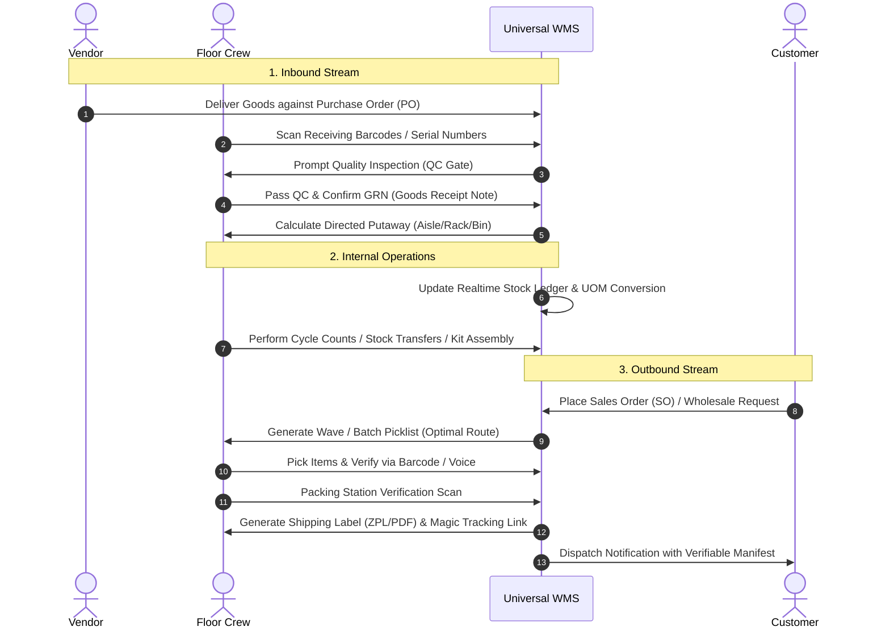

# Project Overview: Universal Warehouse & Stock Management System

---

## 1. Vision & Purpose

Universal WMS is designed to replace single-purpose, rigid inventory applications with an adaptive, omni-industry platform. A business owner or enterprise warehouse director can configure the application for any industry with zero code modifications.

---

## 2. Universal Business Archetype Specifications

```
                               ┌─────────────────────────────┐
                               │ Business Archetype Registry │
                               └──────────────┬──────────────┘
         ┌──────────────────┬─────────────────┼──────────────────┬──────────────────┐
         ▼                  ▼                 ▼                  ▼                  ▼
┌─────────────────┐ ┌───────────────┐ ┌────────────────┐ ┌─────────────────┐ ┌─────────────────┐
│ Leather & Hides │ │Grocery & Foods│ │  Electronics   │ │Bars/Restaurants │ │Fashion & Retail │
└─────────────────┘ └───────────────┘ └────────────────┘ └─────────────────┘ └─────────────────┘
```

### Archetype 1: Leather, Hides & Fabric Stores
* **Primary Dimensions:** Surface Area ($\text{sq. ft.}$, $\text{sq. m.}$), Hide Thickness (oz / mm), Roll Length (yards / meters).
* **Specific Metadata:** Tannery Origin, Dye Lot, Quality Grade (Full Grain, Top Grain, Genuine, Bonded), Defect Zones.
* **Scrap / Off-cut Tracking:** Handles fractional hide remnants, remnant bins, and scrap weight deduction.
* **Intake Workflow:** Multi-hide grading upon receipt with surface area measurement and grade stamping.

### Archetype 2: Grocery, Foods & Perishables
* **Primary Dimensions:** Weight ($\text{kg}$, $\text{g}$), Cartons, Pallets, Inner Bundles.
* **Specific Metadata:** Batch / Lot Number, Harvest / Slaughter Date, Expiration Date, Storage Zone (Ambient, Chilled $+4^\circ\text{C}$, Deep Frozen $-18^\circ\text{C}$).
* **Fulfillment Rules:** Strict **FEFO** (First-Expired, First-Out) picking enforcement with dynamic expiry warnings.
* **Markdown Engine:** Automated discount suggestions for products within critical shelf-life thresholds.

### Archetype 3: Electronics, Mobile Gadgets & Computing
* **Primary Dimensions:** Units, Kits, Bulk Pallets.
* **Specific Metadata:** Dual IMEI (IMEI 1, IMEI 2), Serial Number (S/N), MAC Address, Firmware Version, Condition (Brand New, Refurbished Grade A/B/C, RMA Defective).
* **Fulfillment Rules:** Mandatory scan-verification of exact serial numbers upon intake and outbound packing.
* **Warranty & RMA:** Reverse logistics tracking for customer returns, repair staging, and vendor warranties.

### Archetype 4: Bars, Restaurants, Cafes & Hospitality
* **Primary Dimensions:** Volume ($\text{ml}$, $\text{cl}$, $\text{Liters}$), Kegs, Bottles, Portions, Cans.
* **Specific Metadata:** Vintage / Brew Year, ABV %, Keg Tap ID, Open Date (oxidation countdown).
* **Recipe / Bill of Materials (BOM):** Auto-deducts component spirits, syrups, and perishables upon POS drink/dish sales (e.g., $1\text{ Mojito} = 60\text{ml Rum} + 30\text{ml Lime} + 20\text{ml Syrup}$).
* **Spillage & Wastage:** Granular loss recording (foaming wastage, breakage, tasting samples) with manager sign-off.

### Archetype 5: Fashion, Apparel & Footwear
* **Primary Dimensions:** Matrix Variants ($\text{Size} \times \text{Color} \times \text{Fit} \times \text{Material}$).
* **Specific Metadata:** Season (SS26, FW26), Brand, Gender, UPC / EAN barcode per variant combination.
* **Workflows:** High-speed matrix intake grid and automated garment barcode label generation.

### Archetype 6: General Hardware, Industrial Spare Parts & Raw Materials
* **Primary Dimensions:** Pieces, Sets, Weight, Fastener Packs.
* **Specific Metadata:** OEM Part Number, Manufacturer Code, Bin Weight Capacity, Hazardous Material (HAZMAT) classification.
* **Workflows:** High-density bin locator, cross-reference part lookup, reorder threshold triggers.

---

## 3. End-to-End Operational Lifecycle



---

## 4. Key User Personas

1. **Enterprise Admin / Owner:** Full system configuration, multi-branch overview, financial analytics, dynamic archetype definitions, custom user permissions.
2. **Warehouse Manager:** Inbound PO approval, outbound wave dispatching, workforce task assignment, discrepancy approvals, vendor RMA.
3. **Floor Picker & Staging Operator:** Tablet/PDA mobile interface, single/batch picking, shortest walking path navigation, voice picking assistant.
4. **Packing & QC Inspector:** Packing scan station, damage and photo evidence recording, box sealing, label printing.
5. **Inventory Auditor:** Blind/scan cycle counting, variance reporting, shrinkage investigation.
6. **Store Cashier / POS Clerk:** Fast checkout, inventory lookups, instant receipt printing, table/order billing.
7. **B2B Wholesale Client / Vendor:** Magic link order tracking, packing photo inspection, verified packing list downloads.
