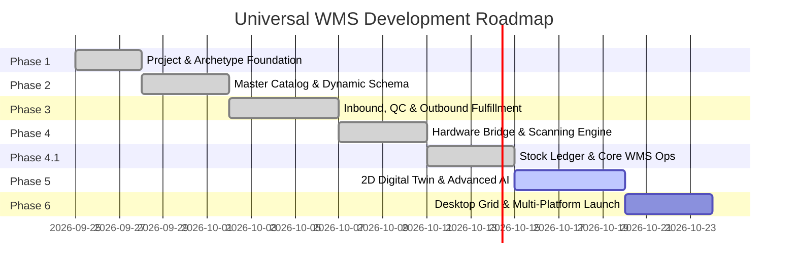

# Master Development Roadmap & Progress Tracker

---

## 📊 Phase Overview

---

## 📌 Detailed Milestone Checklist

### ✅ Phase 1: Foundation, Architecture & Archetype Engine
- [x] Project Documentation Suite (`README`, `OVERVIEW`, `ARCHITECTURE`, `RULES`, `RBAC`, `ROADMAP`).
- [x] Initialize Flutter multi-platform workspace (`com.rudraksha.warehouse`).
- [x] Configure `pubspec.yaml` with Riverpod, GoRouter, Drift, ML Kit, Thermal Printer, Icons.
- [x] Implement Core Dynamic Archetype Schema Engine (Leather, Grocery, Electronics, Hospitality/Bars, Fashion, Hardware, Healthcare/Pharma).
- [x] Strategy-pattern dynamic theming engine with environmental ergonomic palettes (`IArchetypeThemeStrategy`).
- [x] Establish `Result<T>` functional error handling & AppFailure hierarchy.
- [x] Build Design System (Tokens, AppColors, AppTypography, ResponsiveBreakpoints).
- [x] Build Shell Navigation (Desktop Sidebar + Mobile Drawer) with GoRouter.
- [x] Live Dynamic 1-Click Showcase Demo Bar (`DemoArchetypeSwitcherBar`).

### ✅ Phase 2: Master Data, Product Catalog & Dynamic Schema
- [x] Abstract `IProductRepository`, `ICategoryRepository`, `IUomRepository`.
- [x] Universal `Product` entity with dynamic polymorphic `customAttributes` and validation rules.
- [x] Typed Wrapper/Decorator Pattern for compile-time safe vertical models (`LeatherProductWrapper`, `GroceryProductWrapper`, `ElectronicsProductWrapper`, `HospitalityProductWrapper`, `FashionProductWrapper`, `HardwareProductWrapper`, `HealthcareProductWrapper`).
- [x] Multi-Variant Matrix Generator ($\text{Size} \times \text{Color} \times \text{Material}$) with Cartesian SKU builder.
- [x] Recipe / Bill of Materials (BOM) composer engine with component cost rollup and stock bottleneck limits.
- [x] Unit of Measure (UOM) conversion calculation engine (Area, Weight, Volume, Length, Count & Packaging).
- [x] In-Memory / Drift pre-seeded repository with comprehensive demo catalog across all 7 archetypes.
- [x] 5-Tab dynamic Product Form (`ProductFormScreen`) and interactive Product Detail Modal with custom attribute chips.
- [x] Comprehensive test suite for all Phase 2 domain calculation engines & wrappers.

### ✅ Phase 3: Inbound, QC & Outbound Fulfillment
- [x] **Inbound Stream:**
  - [x] Purchase Order (PO) lifecycle, tracking, and status pipeline (`PurchaseOrder`, `PurchaseOrderItem`).
  - [x] Goods Receipt Note (GRN) dock scanning intake.
  - [x] Quality Control (QC) inspection gate (`QcInspectionReport`) with defect logger and dual-signoff witness verification for healthcare narcotics/hazmat.
  - [x] Directed Putaway engine (`DirectedPutawayEngine`) with archetype-aware zone mapping (Vault, Cold room, Flammable, Hanging, Roll racks).
- [x] **Outbound Stream:**
  - [x] Sales Order (SO) intake, allocation, and customer/hospital ward prioritization (`SalesOrder`, `SalesOrderItem`).
  - [x] Intelligent Wave & Batch Picking Engine (`WavePickingOptimizerEngine`) with FEFO sort and shortest walking path sequencing.
  - [x] Packing Station (`PackingSession`) with live barcode verification scanning simulator.
  - [x] Shipping Manifest generation with 4x6 Thermal ZPL/PDF preview modal and B2B Magic Tracking Link.
- [x] 4-Tab Responsive Inbound Dashboard (`InboundScreen`) and Outbound Fulfillment Hub (`OutboundScreen`).
- [x] Comprehensive test suite covering directed putaway, FEFO wave optimization, and packing verification.

### ✅ Phase 4: Hardware Bridge & Multi-Barcode Scanner
- [x] Camera Multi-Barcode AR Batch Scanner (ML Kit) with bounding box overlays and 1.2s debounce deduplication (`MultiBarcodeBatchEngine`).
- [x] Zebra DataWedge & Honeywell Android Broadcast Receiver bridge for laser PDAs (`ZebraDataWedgeBridge`).
- [x] Bluetooth, USB COM & Network Thermal Printer Engine supporting ESC/POS receipts, 4x6 ZPL shipping labels, 3x1 bin tags, and Schedule II narcotics safety tags (`ZplTemplateGenerator`, `EscPosTemplateGenerator`, `MockThermalPrinterDriver`).
- [x] BLE & Serial COM Scale Driver with continuous weight streaming, tare/zero calibration, fastener piece counter, and leather area calculator (`MockWeighingScaleDriver`, `PieceCounterCalculator`).
- [x] 4-Tab Industrial Hardware Studio (`ScannerScreen`) with AR Viewfinder, Thermal Printer Lab, Scale Gauge, and PDA Configuration.
- [x] Comprehensive test suite for hardware scanning, printing, and digital scale calculation.

### ✅ Phase 4.1: Stock Ledger, Transfers, Adjustments & Prototype Completion
- [x] **Stock Ledger & Movement History (`InventoryTransactions`):**
  - [x] Stock movement audit log for every transaction (`PURCHASE_RECEIPT`, `PUTAWAY`, `SALE`, `PICK`, `TRANSFER_OUT`, `TRANSFER_IN`, `ADJUSTMENT_IN`, `DAMAGE`).
  - [x] Granular inventory status calculation per SKU (`Available`, `Reserved`, `Picked`, `Damaged`, `Blocked`, `InTransit`).
  - [x] Dedicated Stock Ledger / Audit Trail tab in Dashboard & Inventory screens (`InventoryLedgerScreen`).
- [x] **Inter-Warehouse Stock Transfers:**
  - [x] Inter-warehouse transfer lifecycle (Transfer Request $\rightarrow$ Approval $\rightarrow$ Pick $\rightarrow$ In-Transit $\rightarrow$ Receiving $\rightarrow$ Putaway with `StockTransferModal`).
- [x] **Stock Adjustments & Discrepancies:**
  - [x] Adjustment logging with reason codes (Damaged, Expired, Missing, Cycle Count discrepancy with `StockAdjustmentModal`).
- [x] **Master Data Management:**
  - [x] Warehouse hierarchy master (Warehouse $\rightarrow$ Zone $\rightarrow$ Rack $\rightarrow$ Shelf $\rightarrow$ Bin with `InMemoryMasterDataRepository`).
  - [x] Supplier and Customer directory views.
- [x] **POS & Counter Checkout:**
  - [x] Reactive Cart state management with barcode scan-to-cart, payment tenders, and ESC/POS thermal receipt generation (`PosCartNotifier`).
- [x] **Web & Cross-Platform Readiness:**
  - [x] Web camera scanner fallback & simulated quick scans in `PosScreen`.
  - [x] Interactive User Role / Persona Switcher (RBAC Live Demo with `userRoleProvider`).

### 🔲 Phase 5: Digital Twin Floorplan, Voice Picking & Advanced Innovations
- [ ] Interactive 2D Warehouse Floorplan Canvas (draw walls, aisles, racks, loading docks).
- [ ] Live Stock Density Heatmap visualizer.
- [ ] Shortest Walking Path A* / Dijkstra route visualizer for pickers.
- [ ] Voice-Directed Picking (VDP) assistant with TTS and Speech-to-Text confirmation digits.
- [ ] Expiry countdown & dynamic markdown suggestion algorithm.
- [ ] B2B Client "Live Packing & Tracking" Magic Link web preview.

### 🔲 Phase 6: Desktop Grid Optimization, Role-Based Access & Launch
- [ ] High-density editable Data Grid with multi-column sorting, filtering, and grouping.
- [ ] Full Role-Based Permission Matrix integration with `<CapabilityGuard>` across all screens.
- [ ] Multi-window and keyboard shortcut navigation for Desktop (Windows, macOS, Linux).
- [ ] Data Export / Import Engine (Excel, CSV, JSON, PDF reports).
- [ ] Comprehensive unit, widget, and golden test suite.
