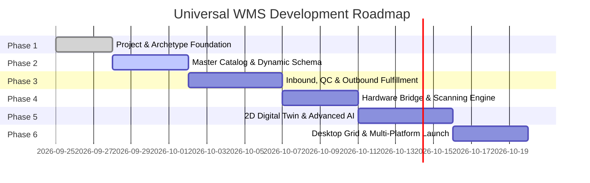

# Master Development Roadmap & Progress Tracker

---

## 📊 Phase Overview

---

## 📌 Detailed Milestone Checklist

### ✅ Phase 1: Foundation, Architecture & Archetype Engine
- [x] Project Documentation Suite (`README`, `OVERVIEW`, `ARCHITECTURE`, `RULES`, `RBAC`, `ROADMAP`).
- [ ] Initialize Flutter multi-platform workspace (`com.rudraksha.warehouse`).
- [ ] Configure `pubspec.yaml` with Riverpod, GoRouter, Drift, ML Kit, Thermal Printer, Icons.
- [ ] Implement Core Dynamic Archetype Schema Engine (Leather, Grocery, Electronics, Hospitality/Bars, Fashion, Hardware).
- [ ] Establish `Result<T>` functional error handling & AppFailure hierarchy.
- [ ] Build Design System (Tokens, AppColors, AppTypography, ResponsiveBreakpoints).
- [ ] Build Shell Navigation (Desktop Sidebar + Mobile Drawer) with GoRouter.

### 🔲 Phase 2: Master Data, Product Catalog & Dynamic Schema
- [ ] Abstract `IProductRepository`, `ICategoryRepository`, `IUomRepository`.
- [ ] Product models with dynamic polymorphic attributes (sq ft for leather, ABV for bars, IMEI for tech, expiry for grocery).
- [ ] Multi-Variant Matrix Generator ($\text{Size} \times \text{Color} \times \text{Material}$).
- [ ] Recipe / Bill of Materials (BOM) manager for Hospitality/Cocktails/Kits.
- [ ] Unit of Measure (UOM) conversion calculation engine.
- [ ] In-Memory & Drift local data source implementations.

### 🔲 Phase 3: Inbound, QC & Outbound Fulfillment
- [ ] **Inbound:**
  - [ ] Purchase Order (PO) creation, tracking, and status pipeline.
  - [ ] Goods Receipt Note (GRN) scanning intake.
  - [ ] Quality Control (QC) inspection gate with photo capture.
  - [ ] Directed Putaway suggestion engine (Aisle $\rightarrow$ Rack $\rightarrow$ Shelf $\rightarrow$ Bin).
- [ ] **Outbound:**
  - [ ] Sales Order (SO) intake and validation.
  - [ ] Intelligent Picking Engine (Single, Wave, Batch, and Zone Picking).
  - [ ] Packing Station barcode verification scan.
  - [ ] Shipping label generator (ZPL / PDF preview) and packing manifest.

### 🔲 Phase 4: Hardware Bridge & Multi-Barcode Scanner
- [ ] Camera Multi-Barcode AR Batch Scanner (ML Kit) with bounding box overlays.
- [ ] Zebra DataWedge & Honeywell Android Broadcast Receiver bridge for laser PDAs.
- [ ] Bluetooth & Network Thermal Printer Engine (ESC/POS, ZPL, TSPL label formats).
- [ ] BLE & Serial COM Scale Driver for auto-capturing scrap/roll/freight weight.

### 🔲 Phase 5: Digital Twin Floorplan, Voice Picking & Advanced Innovations
- [ ] Interactive 2D Warehouse Floorplan Canvas (draw walls, aisles, racks, loading docks).
- [ ] Live Stock Density Heatmap visualizer.
- [ ] Shortest Walking Path A* / Dijkstra route visualizer for pickers.
- [ ] Voice-Directed Picking (VDP) assistant with TTS and Speech-to-Text confirmation digits.
- [ ] Expiry countdown & dynamic markdown suggestion algorithm.
- [ ] B2B Client "Live Packing & Tracking" Magic Link web preview.

### 🔲 Phase 6: Desktop Grid Optimization, Role-Based Access & Launch
- [ ] High-density editable Data Grid with multi-column sorting, filtering, and grouping.
- [ ] Full Role-Based Permission Matrix integration with `<CapabilityGuard>` across all screens.
- [ ] Multi-window and keyboard shortcut navigation for Desktop (Windows, macOS, Linux).
- [ ] Data Export / Import Engine (Excel, CSV, JSON, PDF reports).
- [ ] Comprehensive unit, widget, and golden test suite.
